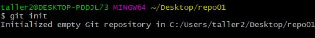
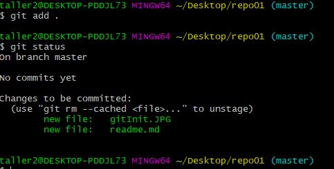
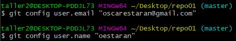
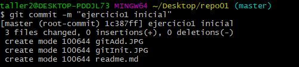
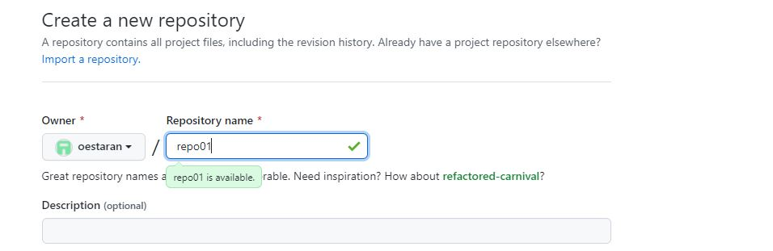
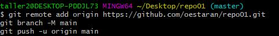
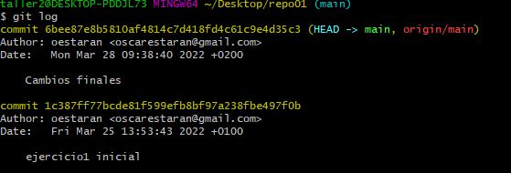

# Ejercicio 1

Iniciamos un repositorio con el comando "git init".  

Añadimos los archivos a la siguiente fase con "git add .". Realizamos también un "git status" para comprobar el estado de los ficheros.  
  

Configuramos el correo y el nombre de usuario para poder hacer el commit.  

Y realizamos el "git commit" para realizar la snapshot.  

Creamos un repositorio remoto con github y lo relacionamos.

Y enganchamos el siguiente codigo para subirlo al repositorio.
  
Modificamos el nombre del fichero para añadirlo como "README.md".  
A continuación la lista de todos los commits hasta el momento:  
